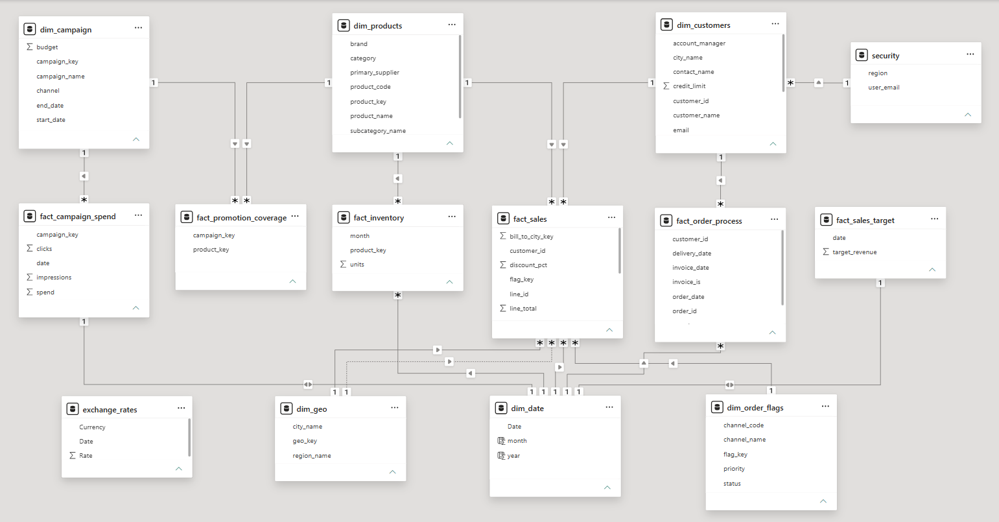

# 🏛 Data Model Architecture

This document outlines the architecture of the Power BI semantic model developed for this project. The model follows dimensional modeling best practices to deliver a scalable, maintainable, and analytics-ready foundation for reporting.

---

## Architecture Overview

The semantic model follows a **Galaxy Schema**, where multiple fact tables share common dimensions. This design supports multiple business processes while maintaining consistent business definitions across the model.

---

## Fact Tables

Each fact table represents a distinct business process.

| Fact Table | Business Process |
|------------|------------------|
| `fact_sales` | Sales transactions |
| `fact_inventory` | Inventory snapshots |
| `fact_sales_target` | Sales targets |
| `fact_campaign_spend` | Marketing campaign expenses |
| `fact_promotion_coverage` | Promotion participation |
| `fact_order_process` | Order fulfillment lifecycle (Accumulating Snapshot Fact) |

---

## Dimension Tables

Dimension tables provide descriptive attributes that enrich business analysis and filter related fact tables.

Core dimensions include:

- `dim_products`
- `dim_customers`
- `dim_date`
- `dim_geo`
- `dim_campaigns`
- `dim_order_flags`

These dimensions are reused across multiple fact tables to maintain consistency and eliminate redundancy.

---

## Relationship Design

The model follows these design principles:

- One-to-many relationships between dimensions and facts
- Single-direction filter propagation
- No direct fact-to-fact relationships
- Shared dimensions across multiple business processes
- Clearly defined table grain
- Surrogate keys for reliable relationships

This structure minimizes ambiguity while improving model performance and maintainability.

---

## Role-Playing Geography Dimension

The `dim_geo` table serves as a **Role-Playing Dimension**, supporting multiple business perspectives using a single geography table.

Within `fact_sales`, it is related to:

- `bill_to_city`
- `ship_to_city`

This enables analysis by both billing and shipping locations without duplicating geography data.

> **Design Decision:** Although `dim_date` is a common candidate for a role-playing dimension, it would have required several inactive relationships that were unnecessary for the current reporting requirements. Using `dim_geo` resulted in a cleaner and more practical semantic model.

---

## Model Validation

After building the semantic model, the following validation checks were performed:

- Verified relationship cardinality
- Confirmed filter propagation
- Validated row counts against source data
- Tested DAX measures
- Checked shared dimension behavior
- Verified Row-Level Security (RLS)

These checks ensured that the model remained accurate, performant, and ready for enterprise reporting.
