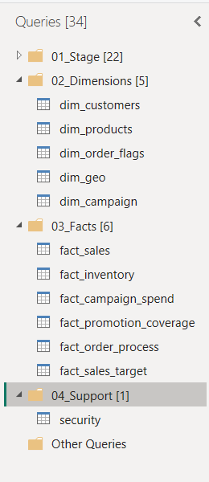

# ⚙️ Power Query Organization

A well-organized Power Query environment is essential for maintaining large semantic models. Instead of keeping all queries in a single flat list, this project groups queries by their purpose, making the ETL process easier to understand, maintain, and extend.

---

## Query Folder Structure

The Power Query Editor is organized into the following groups:

```text
📁 01_Stage
📁 02_Dimensions
📁 03_Facts
📁 04_Support
📁 Other Queries
```



---

## 📥 01_Stage

The **Stage** folder contains raw source tables imported from the OLTP database.

These queries serve as the foundation for all transformations and remain as close to the source data as possible.

**Purpose**

- Import source data
- Preserve original structure
- Serve as reusable data sources

---

## 📊 02_Dimensions

This folder contains all dimension tables used in the semantic model.

Examples include:

- `dim_products`
- `dim_customers`
- `dim_date`
- `dim_geo`
- `dim_campaigns`
- `dim_order_flags`

These queries perform data cleansing, standardization, and enrichment before loading into the model.

---

## 📈 03_Facts

The **Facts** folder contains all business process tables.

Implemented fact tables include:

- `fact_sales`
- `fact_inventory`
- `fact_sales_target`
- `fact_campaign_spend`
- `fact_promotion_coverage`
- `fact_order_process`

Each fact table is transformed independently while maintaining a clearly defined grain.

---

## 🛠 04_Support

Support queries contain reusable components that assist data preparation but are not loaded into the semantic model.

Typical examples include:

- Reference queries
- Lookup tables
- Helper transformations
- Intermediate calculations

These queries simplify development and reduce duplicated transformation logic.

---

## 📂 Other Queries

This folder stores miscellaneous queries that are not part of the final semantic model, such as temporary development queries or experimental transformations.

Keeping these separate helps maintain a clean and organized workspace.

---

## ✅ Benefits

Organizing Power Query into logical groups provides several advantages:

- Easier navigation
- Improved maintainability
- Clear separation of ETL stages
- Reduced development complexity
- Better collaboration
- Faster onboarding for new developers

---

## Best Practices Followed

- Grouped queries by purpose
- Kept staging queries separate from transformed tables
- Loaded only required queries into the model
- Used meaningful, consistent naming conventions
- Minimized duplicated transformation logic
- Organized the ETL workflow for scalability

---

## Summary

A structured Power Query environment makes enterprise semantic models easier to build, maintain, and extend. By separating staging, dimensions, facts, and support queries, the ETL process remains organized, scalable, and easier to understand as the model grows.
