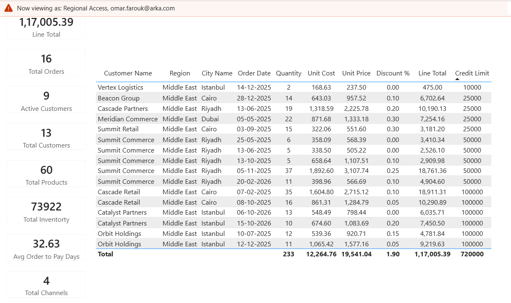

# 🔒 Dynamic Row-Level Security (RLS)

This project implements **Dynamic Row-Level Security (RLS)** to ensure users only access data relevant to their assigned region. Unlike static RLS, access is determined dynamically based on the signed-in user's identity.

---

## Overview

Dynamic RLS filters data automatically using a security mapping table that associates each user with their permitted region(s).

When a user opens the report, Power BI identifies their account and applies the corresponding filter without requiring separate roles for each user.



---

## Implementation

The implementation consists of three components:

### 1. User Security Table

A dedicated security table stores user permissions.

| User Email | Region |
|------------|--------|
| user1@company.com | Europe |
| user2@company.com | North America |
| user3@company.com | Asia |

Each row defines the region(s) a user is authorized to access.

---

### 2. Model Relationships

The security table is related to the Customers dimension (`dim_geo`), allowing security filters to propagate through the semantic model to all related fact tables.

```text
User Security
      │
      ▼
dim_customers
      │
      ▼
Fact Tables
```

---

### 3. Security Filter

The RLS role filters the security table using the signed-in user's email.

```DAX
[region] = LOOKUPVALUE(security[region],security[user_email],USERPRINCIPALNAME())
```

Power BI automatically applies the matching region filter throughout the semantic model.

---

## Why Dynamic RLS?

Compared to creating separate roles for each region or user, Dynamic RLS offers several advantages:

- Scales to hundreds or thousands of users
- Requires only one security role
- Simplifies administration
- Automatically adapts to user permissions
- Centralizes access management in a single table

---

## Benefits

Dynamic RLS provides:

- Secure data access
- Personalized report views
- Reduced maintenance effort
- Consistent security across all reports
- Enterprise-ready access control

---

## Summary

By implementing **Dynamic Row-Level Security**, the semantic model delivers secure, scalable, and maintainable access control. User permissions are managed through a security mapping table, while Power BI automatically filters data based on the signed-in user's identity, eliminating the need for multiple static roles.
